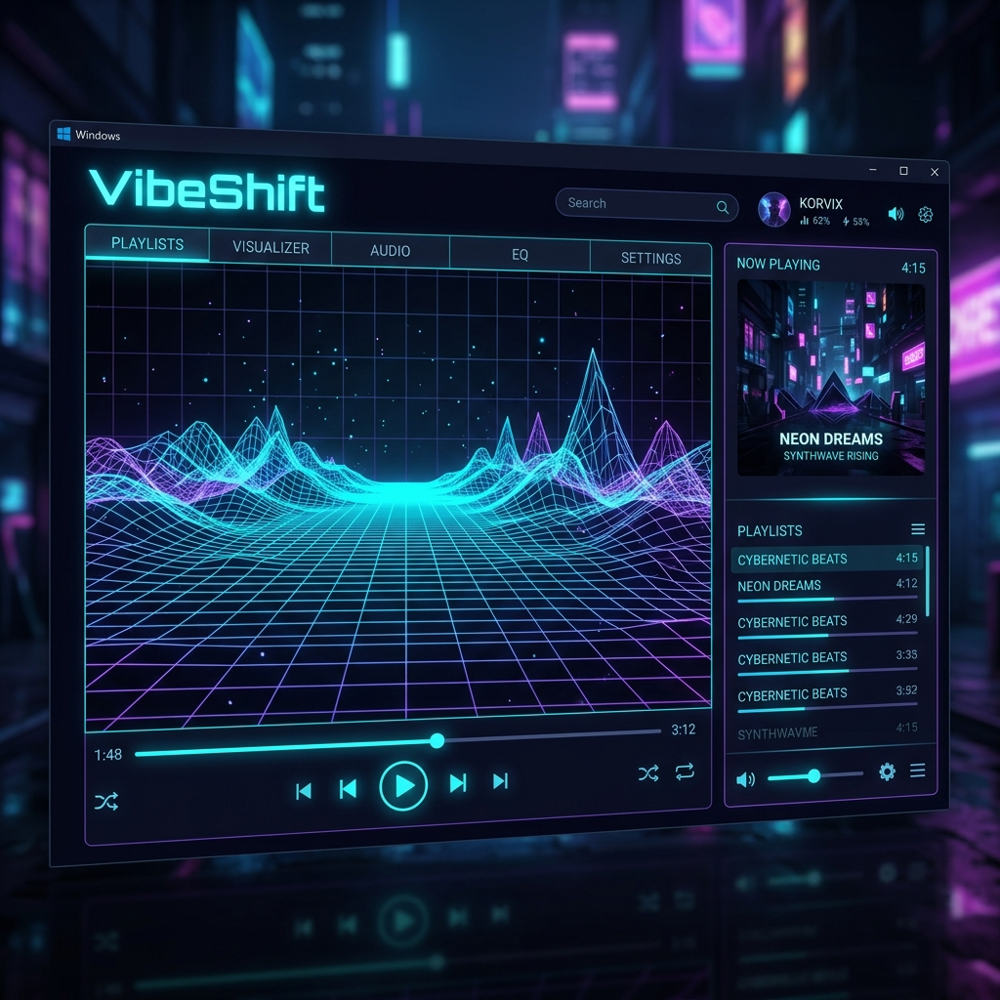

# VibeShift — Synesthetic Music Discovery Platform

> **Control the canvas. Shift the vibe. Hear the visuals.**



**Live Demo Website:** [https://vibeshift-music-4q94-pi.vercel.app](https://vibeshift-music-4q94-pi.vercel.app)

Welcome to **VibeShift**! A visual and auditory playground designed to bridge the gap between human mood, aesthetics, and music. 

Have you ever wondered what your mood looks like, or wanted to generate a playlist simply by selecting a color temperature or setting a weather pattern? VibeShift turns this synesthetic experience into a playable web application.

---

## The Synesthetic Experience

VibeShift is built on the concept of **synesthesia**—the crossing of sensory pathways. Instead of searching for tracks using static text inputs, you interact with a digital blueprint console:
* **The Vibe Grid:** A 2D interactive canvas where you plot your state of mind. Drag your cursor between *Chill vs. High Energy* and *Melancholic vs. Euphoric*.
* **Atmospheric Presets:** Inject environmental feelings into your soundscape by changing the weather (from stormy *Thunderstorms* to glowing *Radiant* sunlight).
* **Responsive Visualizer:** Watch WebGL fluid shaders and dynamic canvas oscilloscope waves morph, pulse, and shift colors in real-time, matching your active coordinates and custom themes.
* **Smart Music Matching:** Choices are instantly translated into sonic variables, querying YouTube to stream matching audio tracks directly on the screen.

---

## Core Features

* **Interactive 2D Canvas Controls:** Drag and plot coordinates to fine-tune your energy.
* **Dynamic YouTube Streaming Engine:** Integrated scraper that bypasses complex authentication to match and load track streams instantly.
* **Custom Iframe Controller:** Built with a clean `postMessage` listener to play, pause, skip, and manage audio tracks smoothly.
* **Custom Themes & Spectra:** Select from five retro-futuristic themes (rose, cyan, emerald, purple, parchment) or design your own custom color spectrum.
* **Cyberpunk Avatars:** Choose your identity from a set of retro avatars (DJ, Cyber Cat, Retro Robot, Explorer, Pixel Ghost).
* **Community Gallery:** Publish your custom mood states and playlists to Firestore for other users to load and play.
* **Installable PWA:** Fully configured Progressive Web App—install it directly to your mobile home screen or desktop dock for standalone access.

---

## Tech Stack & Architecture

VibeShift is organized as a lightweight monorepo:

### Frontend
* **Core:** React 19 + TypeScript + Vite
* **Styling:** Custom CSS (Zero Tailwind dependencies, hand-crafted wireframe consoles, CRT glassmorphic scanlines, and animated film grains)
* **Graphics:** Three.js (WebGL fluid shaders) + HTML5 Canvas (Oscilloscope wave generator)
* **Database & Auth:** Firebase Firestore & Client SDK

### Backend
* **Server:** Node.js + Express
* **Scraper:** Axios YouTube crawler (extracts search results and stream metadata safely on the server side)
* **Platform integration:** Configured to run locally as an Express app, or in production as a serverless **Firebase Cloud Function**.

---

## Local Setup & Quick Start

Getting VibeShift running on your local machine is simple. 

### Prerequisites
Make sure you have [Node.js](https://nodejs.org/) installed.

### 1. Clone & Install Dependencies
From the project root directory, run the monorepo helper script to install dependencies for both the frontend and backend:
```bash
npm run install-all
```

### 2. Run the Servers Concurrently
Start the local Node Express backend (port `3001`) and the Vite React frontend (port `5173`) together:
```bash
npm run dev
```

Now, open your browser and navigate to:  
**[http://localhost:5173](http://localhost:5173)**

---

## Deployment

### Firebase Hosting
To build the static assets and deploy to Firebase Hosting:
```bash
# Compile React assets
npm run build --prefix frontend

# Deploy to Firebase
firebase deploy --only hosting
```

### Firebase Cloud Functions (Express Backend)
If your Firebase project is upgraded to the **Blaze (pay-as-you-go) plan**, you can deploy the YouTube scraper backend as a serverless function:
```bash
firebase deploy --only functions
```

---

*Created by [Advaith](https://github.com/advaith-renjith-2004)*
